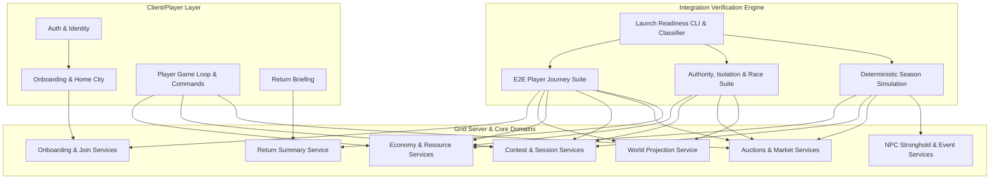
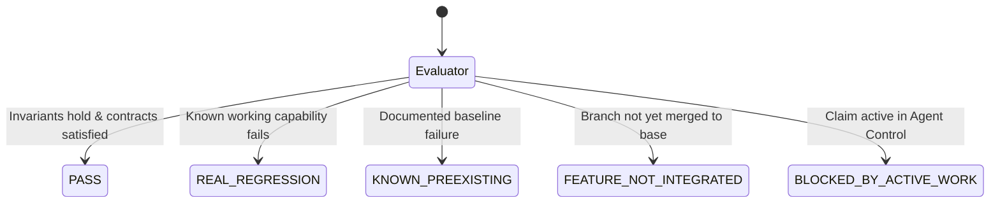

# The Grid: Launch Readiness Verification & Integration Layer Design

**Author**: Agy (Integration, QA, and Launch Hardening)  
**Date**: 2026-09-17  
**Base**: `grid-integration-20260917`  
**Status**: APPROVED / IMPLEMENTATION  

---

## 1. Executive Summary

As The Grid approaches multi-agent convergence, independently engineered systems must coexist without silent data corruption, cross-city/cross-season state leakage, front-running races, or unverified server-authority handoffs.

This document establishes the architecture for **The Grid Launch Readiness Verification Layer**, comprising:
1. **End-to-End Player Journey Integration Matrix**: Proving coexistence across all currently implemented player phases (Auth -> Onboarding -> Season Join -> Starter Claim -> World Projection -> Development & Economy -> Contest & Ownership -> Return State -> Auctions & Market -> NPC, Events & Surge).
2. **Server Authority & Security Verification Suite**: Automated verification of city/season isolation, idempotency, stale write handling, anti-cheat server authority, privacy protection (no leaked internal identifiers or opponent policies), and race/concurrency handling.
3. **Deterministic Small-Season Simulation**: A multi-agent synthetic simulation with 100% reproducible pseudo-random state transitions that stresses full season lifecycles in memory without touching production databases.
4. **Launch Verification Classifier & Diagnostic Dashboard**: A single CLI runner that dynamically detects active agent claims, categorizes results into 5 rigorous states (`PASS`, `REAL_REGRESSION`, `KNOWN_PREEXISTING_FAILURE`, `FEATURE_NOT_INTEGRATED_YET`, `BLOCKED_BY_ACTIVE_WORK`), and reports actionable status for release managers.

---

## 2. Architecture & Coexistence Matrix

The Grid is architected around clean domain cores, port interfaces, and server adapters. The integration verification layer operates directly across these architectural boundaries.

---

## 3. Player Journey Boundary Contracts

| Stage | Input Boundary | Preconditions | State Transitions | Invariants Verified |
| :--- | :--- | :--- | :--- | :--- |
| **1. Auth & Session** | Token / Session ID | Valid player record | Resolves `playerId`, loads profile | Reject blank/empty/malformed IDs; safe anonymous fallback |
| **2. Home City** | `playerId`, `cityId` | Registered player | Confirmed home city recorded | Unconfirmed player cannot join season; confirmation is idempotent |
| **3. Season Join** | `playerId`, `seasonId`, `idempotencyKey` | Confirmed home city, active season | Starting wallet granted (`credits`, `influence`, `commandPoints`) | Duplicate submit returns identical state without double-granting credits |
| **4. Starter Claim** | `playerId`, `territoryId`, `idempotencyKey` | Joined season, 0 territories owned | Territory transferred to player; costs deducted; event emitted | Only designated starter territories claimable; double-claim rejected |
| **5. World Projection** | `seasonId`, `viewerPlayerId` | Season configured | Generates reactive GeoJSON/world snapshot | Ownership flags (`you`, `occupied`, `neutral`), accurate skyline & district stats |
| **6. Development & Economy** | `propertySlug`, `branch`, `level` | Owned property, sufficient credits | Development level incremented; income rates updated | Enforce tree prerequisites; offline accrual caps respected |
| **7. Contests & Attack** | `attackerPlayerId`, source/target territory | Adjacency, sufficient influence | Offline defense policy queried; Signal Dice resolved; damage applied | Server rolls dice; defenders favored on ties; capture on 0 influence |
| **8. Return Summary** | `playerId`, `since`, `now` | Returning player | Calculates billable time, resource accruals, attack alerts | Accrual capped at configured offline maximum; highlights filtered |
| **9. Auctions & Market** | `propertyId`, `bidAmount` / listing | Open auction / active listing | Bid recorded, previous bidder refunded, transfer on settlement | Strict minimum increments; atomic transfer on settlement; fee deduction |
| **10. NPC & Surge Projections** | `seasonId`, `now` | Configured strongholds, finale schedule | Stronghold targets mapped; Surge timing transitions | Strongholds contestable; Surge bonuses active during finale |

---

## 4. Security, Authority & Isolation Requirements

### 4.1 Server Authority
- **Zero Client Trust**: All rolls (Signal Dice), combat outcomes, resource calculations, and asset settlements must occur on the server.
- **Precondition Enforcement**: Adjacency between territories, ownership of attacking territories, and sufficient balances must be strictly evaluated prior to action execution.

### 4.2 City & Season Isolation
- **Tenant Boundaries**: A player or asset from Season A must never be modified or read by an operation targeting Season B.
- **Cross-City Containment**: Territories and properties in Canton cannot be claimed or contested via actions referencing another city package.

### 4.3 Idempotency & Replay Protection
- All state-mutating commands (Join, Claim, Develop, Attack, Bid, Buy, Settle) require an `idempotencyKey`.
- Identical command replays must return the original cached or persisted result without re-executing state side effects (no double charging, no duplicate events).

### 4.4 Stale Writes & Concurrency
- **Concurrent Claims**: If two players submit starter or neutral claims for the same parcel simultaneously, exactly one must succeed; the second must fail with a descriptive conflict.
- **Auction Bid Sniping**: A bid submitted against an auction must verify that the amount exceeds the current `leading_bid_credits` at the moment of evaluation.
- **Market Overlap**: If a property is simultaneously under an active auction and direct deal, atomic locks must ensure double-selling is strictly impossible.

### 4.5 Privacy Protection
- Public endpoints and world projections must never expose:
  - Database primary keys of internal tables (`id` where UUID/surrogate)
  - Anti-fraud flags, ban states, or risk telemetry
  - Opponents' private defense policies, auto-retreat thresholds, or unspent influence balances
  - Unsafe property display names where `public_name_safe` is false.

---

## 5. Deterministic Season Simulation Model

The small-season simulation tests system coexistence through a multi-agent loop running on Mulberry32 seeded RNG.

### 5.1 Simulation Parameters
- **Synthetic Players**: 4–8 players with distinct behavioral archetypes:
  - *Aggressive Conqueror*: Prioritizes adjacency claims and combat attacks.
  - *Economic Developer*: Prioritizes property acquisitions and commercial upgrades.
  - *Market Speculator*: Prioritizes auction bidding and fixed-price flips.
  - *Casual Defender*: High offline cadence (24h), relies on offline defense policies.
- **Simulation Duration**: Multi-tick (e.g., 72–720 simulated game hours).
- **Phases**: Regular Season -> Mid-season Auctions -> Finale Surge -> Season Settlement.

### 5.2 Deterministic Invariants
1. **Conservation of Assets**: $\sum \text{Owned Parcels} + \sum \text{Neutral Parcels} = \text{Total Package Parcels}$ at every tick.
2. **Exclusivity**: No parcel may be owned by more than one player at any tick.
3. **Non-Negative Balances**: No player may end a tick with negative credits, influence, or command points.
4. **Monotonic Progression**: Season timestamps, round numbers, and event sequence numbers must strictly increase.
5. **Reproducibility**: Identical seed produces bit-for-bit identical final ledger, metrics, and rankings.

---

## 6. Verification Report Classification Model

The launch-readiness runner distinguishes five explicit states:

1. **`PASS`**: Implemented layer passed all unit, integration, and security checks.
2. **`REAL_REGRESSION`**: An invariant or contract on merged code failed unexpectedly.
3. **`KNOWN_PREEXISTING_FAILURE`**: Known failure outside The Grid scope (e.g. legacy live database tests expecting external credentials).
4. **`FEATURE_NOT_INTEGRATED_YET`**: Grid feature planned or developed on separate unmerged branches.
5. **`BLOCKED_BY_ACTIVE_WORK`**: Domain actively claimed in `.git/grid-agent-control/claims/*.json`.

---

## 7. Deliverables & Implementation Plan

1. **`docs/superpowers/plans/2026-09-17-the-grid-launch-readiness.md`**: Detailed execution plan and checklist.
2. **`tests/grid-integration-journey.test.ts`**: Complete 10-stage player journey integration test.
3. **`tests/grid-integration-security.test.ts`**: Authority, isolation, idempotency, stale write, and privacy test suite.
4. **`tests/grid-season-simulation.test.ts`**: Deterministic synthetic multi-player season simulation.
5. **`scripts/grid-launch-verify.ts`**: Unified launch-readiness CLI runner and reporter.
6. **`scripts/grid-integration-verify.ts`**: Programmatic diagnostic runner.
